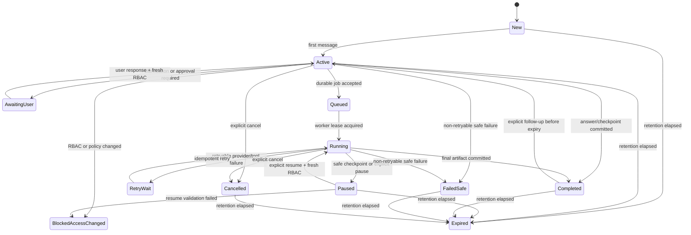

# Admin AI API Continuity and Model Routing PRD

Status: Approved implementation contract
Scope: Admin AI Copilot / Admin V2
Repository: `C:\Users\Yours Wellness\Documents\Codex`
Decision date: 2026-07-28
Document owner: Product and Engineering

Authoritative product specifications:

1. `pasted-text-1.txt`
   - SHA-256: `031CF2D157DE151EEDE82AD84B7ACF2DAEDBE5E5BFF5C3882836B4339DBA9FE4`
   - 612 physical lines
2. `pasted-text-2.txt`
   - SHA-256: `5B438515D09C477CBC52C19FD1D47A4C14F3EF534806D68CA9EC98176E3B206C`
   - 1,414 physical lines

Locked product decisions:

- Saved Admin AI tasks persist for 90 days.
- The same admin can explicitly resume a saved task after logout/login and on another device.
- Every request and resume performs fresh authentication, RBAC, owner-policy, source-access, and data-freshness validation.
- Approved safe preferences persist until that admin manually clears them or the account is deleted.
- Admin AI audit and observability records persist for 90 days.
- Logout clears transient browser, request, provider, selection, OTP, secret, and active-chat context. It does not silently delete saved tasks, artifacts, approved safe preferences, or audit records.
- “Clear conversation/context” starts a fresh conversation boundary. It does not silently delete saved tasks, reusable artifacts, approved safe preferences, or audit records.
- The default provider route is `gpt-5.6-luna` with `low` or `medium` reasoning selected by task class.
- Deterministic security and business rules remain outside the model.

## 1. Executive Summary

### Problem Statement

The current Admin AI Copilot does not yet provide reliable application-owned continuity. A fresh API call is stateless unless the application reconstructs the task, requirements, decisions, permissions, and current data; the current UI keeps only a bounded 30-minute browser-session snapshot and passes no live provider adapter to the Copilot model router.

Without a durable continuity layer, the user experiences each call as a new assistant that must be retaught the task. A naïve provider-only conversation implementation would also conflict with the specifications’ logout, RBAC, privacy, token-efficiency, and failure-safety requirements.

### Proposed Solution

Build a server-owned Admin AI continuity service that persists a compact, permission-scoped task capsule for 90 days and reconstructs every model request from authoritative policies, fresh RBAC, fresh source data, saved task state, and a bounded safe conversation summary.

Use the OpenAI Responses API from the server with `store: false`. Route normal Admin AI language tasks to `gpt-5.6-luna` with `reasoning.effort: low`; route cross-module, compatibility, conflict-analysis, and complex reporting tasks to the same model with `reasoning.effort: medium`. Keep permissions, OTP, validation, payment status, calculations, route protection, authorization, and destructive-action gates in deterministic code.

This is layered continuity:

```text
Headroom/Codex session memory is not a product dependency.
Provider state is not the source of truth.

Server task capsule + fresh auth/RBAC/data + versioned requirements
                              |
                              v
                  compact provider request
                              |
                              v
            validated answer/checkpoint/artifact/audit
```

### Success Criteria

- 100% of scripted same-user navigation, reload, logout/login, and cross-device resume tests recover the correct saved task without asking the admin to restate already-saved requirements.
- 100% of resume and message requests revalidate the current session, RBAC permissions, owner policy, source access, and data freshness before exposing data or invoking a model.
- 100% of deterministic task classes make zero provider calls.
- 0 secrets, OTPs, session tokens, payment credentials, raw authorization headers, or unauthorized record bodies appear in persisted task capsules, provider payloads, logs, or artifacts.
- At least 98% of the approved compatibility/conflict evaluation set correctly identifies whether two requirements conflict and cites the controlling requirement IDs; all security-critical cases must score 100%.
- Routine `low` requests stay at or below 4,000 estimated input tokens and 700 output tokens at p95. `medium` requests stay at or below 8,000 estimated input tokens and 2,400 output tokens at p95.
- 100% of records subject to the 90-day policy become inaccessible by the expiry time plus a maximum 24-hour purge SLA.
- Core Admin V2 workflows remain usable when the AI provider, queue, or continuity service is unavailable.

### Product Principle

The strongest model is not automatically the best product route. For this workload, the best default is the smallest model and reasoning effort that passes the quality and safety gates. Official current model guidance positions `gpt-5.6-luna` for efficient, high-volume workloads, while `gpt-5.6-sol` is the current flagship. This PRD deliberately chooses Luna low/medium because Admin AI has bounded context, deterministic safety controls, strong retrieval, and cost-sensitive repeated use.

## 2. User Experience & Functionality

### User Personas

- **Owner / Global Admin:** configures AI policy, model routing, limits, retention, knowledge sources, and audit visibility.
- **Authorized Admin:** uses Copilot within assigned modules and can resume only their own permission-valid tasks.
- **Limited-role Admin:** receives the same continuity experience without gaining access to hidden modules, records, fields, actions, or artifacts.
- **Auditor / Incident Reviewer:** verifies model route, evidence, actions, denials, retries, retention, and deletion without receiving raw sensitive prompts.

### User Stories and Acceptance Criteria

#### Story 1: Continue a task while navigating

As an admin, I want Copilot to retain my active task while I move between allowed Admin V2 pages so that I can complete a cross-module investigation without repeating the goal.

Acceptance criteria:

- The active task ID and safe task summary remain available during allowed route changes.
- The current page contributes a fresh section-context object on each request.
- Saved selected records are re-resolved against current RBAC and current source data; cached row bodies are not trusted.
- If a selected record is gone, stale, or no longer visible, Copilot names the missing input and does not guess.
- A route change cancels stale in-flight browser work unless it is attached to a real durable job.

#### Story 2: Resume after logout/login or on another device

As an admin, I want to resume my saved task after signing in again, including on another device, so that a long investigation does not disappear.

Acceptance criteria:

- Logout immediately clears the active UI conversation, browser-session snapshot, current selections, pending confirmations, OTPs, secrets, provider handles, and in-flight request state.
- Logout does not delete the server-owned saved task, approved safe preferences, durable artifacts, or audit records.
- After a fresh login, the same admin sees a neutral “Saved tasks” list containing safe title, status, last activity, expiry, and permitted artifact count.
- No saved task is automatically injected into a new post-login chat. The admin must select “Resume.”
- Resume creates a new authenticated execution boundary and revalidates RBAC, owner policy, source access, and data freshness.
- A different admin cannot discover the task through IDs, search, counts, URLs, timing differences, or artifact endpoints unless an explicit artifact-sharing policy permits it.
- If access changed, the task enters `blocked-access-changed`; the UI explains which capability is unavailable without revealing restricted data.

#### Story 3: Start fresh without destructive deletion

As an admin, I want “Clear conversation/context” to start a clean conversation without silently deleting my saved work or compliance history.

Acceptance criteria:

- The action cancels or detaches the active transient request, clears the composer, current selections, recent-turn buffer, transient provider state, and local response snapshot.
- A new conversation ID is created on the next message.
- A running durable job is not silently deleted. The UI offers a separate explicit Cancel action.
- Saved tasks, task checkpoints, reusable artifacts, approved safe preferences, and audit records remain unchanged.
- Explicit “Delete saved task,” “Delete artifact,” and “Clear safe memory” actions remain separate, permission-checked operations.

#### Story 4: Preserve safe preferences

As an admin, I want approved formatting and workflow preferences to persist so that Copilot improves without storing sensitive business data.

Acceptance criteria:

- Allowed preferences are limited to approved report format, language, response length, workflow preferences, known bug categories, repeated UI pain points, rejected generic phrasing, and concise report/copy style.
- Preferences are stored server-side per admin and may also be cached locally.
- Raw prompts, full record bodies, secrets, OTPs, tokens, payment credentials, unauthorized coach data, or model chain-of-thought are never converted into preference memory.
- Only reviewed and approved corrections may update safe learning.
- “Clear safe memory” disables memory, removes the admin’s derived safe preferences and approved correction material, and records a non-sensitive audit event.
- Clearing safe memory does not erase the mandatory 90-day security audit trail.

#### Story 5: Receive the right level of intelligence

As an admin, I want routine checks to be fast and efficient and complex compatibility work to receive enough reasoning so that quality does not depend on using the most expensive model for every action.

Acceptance criteria:

- Routine explanation, summary, bounded search, and small copy tasks use Luna with low reasoning.
- Multi-file/spec compatibility, requirement conflict detection, cross-module investigation, anomaly analysis, multi-step planning, complex reporting, error clustering, and security recommendations use Luna with medium reasoning.
- The UI may show a plain-language route such as “Fast check” or “Deep analysis”; internal provider details are visible only where owner policy allows.
- Route choice is logged with model, reasoning effort, token counts, latency, outcome, fallback reason, and estimated cost when available.
- The user is warned before a large report exceeds the normal record or job budget.

#### Story 6: Remain safe during failures and permission changes

As an admin, I want Copilot to fail safely without blocking manual Admin V2 work.

Acceptance criteria:

- Provider, queue, or task-store failure never crashes the page or blocks core admin controls.
- A read-only request may fall back to a deterministic safe result when that result is honest and useful.
- A failed or timed-out model call never produces a fabricated answer or success state.
- Retries are idempotent and never repeat a mutation.
- Permission or policy changes invalidate the active execution boundary before the next data read or tool call.
- Partial safe report content may be checkpointed; unsupported completion is never claimed.

### Primary User Flows

#### Active conversation flow

1. Admin opens Copilot.
2. Client requests a new or selected task boundary.
3. Server authenticates the session and loads current RBAC and owner policy.
4. Server builds the current section context from permission-visible data.
5. Continuity service loads the task capsule, validates its schema and expiry, and re-resolves saved references.
6. Router selects deterministic, Luna low, or Luna medium.
7. Server invokes the provider only when required.
8. Output passes redaction, grounding, action, and response-policy validation.
9. Server atomically writes the safe checkpoint, artifacts, and audit metadata.
10. Client renders the result and safe next actions.

#### Logout and later resume flow

1. Admin logs out.
2. Server records logout and clears the auth cookie.
3. Client clears session storage, current UI state, in-flight requests, pending approvals, secrets, and provider context.
4. The 90-day saved task remains server-side and inaccessible without authentication.
5. The same admin logs in on any device and explicitly chooses “Resume.”
6. Server creates a new execution boundary, performs fresh RBAC and data validation, and presents a safe resume preview.
7. The admin confirms resume; Copilot continues from the latest valid checkpoint.

### Conversation and Task State Machine



State rules:

- Only a real server-owned job with a durable job ID may enter `queued`, `running`, `paused`, or `retry-wait`.
- A browser fetch cannot be labeled resumable background work.
- Every transition is versioned and uses optimistic concurrency.
- `resume`, `retry`, `cancel`, artifact creation, and any mutation require an idempotency key.
- Logout does not transition or delete a saved task; it invalidates the execution boundary.
- Clear context closes the active conversation boundary but leaves saved task state and durable jobs intact unless the admin separately cancels or deletes them.

### Data Lifecycle and Retention Matrix

| Data class | Storage | Retention | Logout | Clear context | Manual clear/delete |
|---|---|---:|---|---|---|
| Auth cookie, CSRF material, OTP, confirmation nonce | Secure transient/session stores | Session or shortest existing security TTL | Delete/invalidate immediately | Delete pending conversation-scoped nonce | Security flow only |
| Raw provider request buffer | Process memory only | Request lifetime | Abort and discard | Abort and discard | Not applicable |
| Provider response ID or encrypted reasoning continuation | Optional transient job memory only; never source of truth | Maximum 15 minutes and never across logout | Delete | Delete | Not applicable |
| Browser active response, selections, recent-turn buffer | Memory/session storage | Active session; current legacy maximum is 30 minutes | Delete | Delete | Not applicable |
| Saved task capsule and checkpoints | Server database | 90 days from last valid task activity or final status | Preserve | Preserve | Separate explicit delete; audit remains |
| Safe conversation summary and pinned requirements | Server database inside task boundary | Same 90-day task retention | Preserve but do not auto-load | Prior task preserves; new conversation starts empty | Separate explicit task delete |
| Reusable Admin AI artifact | Existing durable artifact store | 90 days from last artifact version unless exported into an independently governed business record | Preserve | Preserve | Separate permission-checked delete |
| Approved safe preferences and derived safe learning | Existing per-admin settings store | Until manual clear or account deletion | Preserve | Preserve | “Clear safe memory” deletes derived memory |
| Raw correction submission awaiting review | Restricted correction store | 90 days | Preserve | Preserve | Withdraw if supported; audit remains |
| Admin AI audit, denial, action, model-route, and observability records | Server database | Exactly 90 days from event creation | Preserve | Preserve | Not user-deletable before policy expiry |
| Application logs containing only request IDs and safe operational metadata | Restricted logging platform | Maximum 90 days | Preserve | Preserve | Operations policy |
| Backup copies of expired records | Encrypted backup system | Logically inaccessible at day 90; physically aged out within 30 additional days | Not applicable | Not applicable | Never restore an already-expired record to active service |

Retention enforcement:

- A daily purge job deletes expired task, checkpoint, artifact, correction, observability, and audit rows in bounded batches.
- Expired records become unreadable at the API layer immediately at `expires_at`; cleanup lag cannot extend user-visible retention.
- Purge completion p95 is within 6 hours and maximum is 24 hours.
- Audit events use event creation time and never extend retention because a task is resumed.
- Task activity may move the task expiry to 90 days after the new valid activity; it does not alter the fixed expiry of older audit events.
- The owner UI displays the effective 90-day policy but cannot silently increase it in this release.

### UX Content Requirements

- Use “Clear conversation/context” for a fresh chat boundary.
- Use “Clear safe memory” for approved preference deletion.
- Use “Delete saved task” for task deletion.
- Use “Cancel task” for a running durable job.
- Never label logout as “Delete history.”
- Before resume, show: saved goal, last safe step, current status, last activity, expiry, and “Permissions and data will be checked again.”
- On access change, show a neutral blocked state without naming hidden modules or records.
- Loading uses step/status feedback; it must not use decorative motion or freeze the underlying admin UI.
- All controls require keyboard access, visible focus, accessible status announcements, and reduced-motion behavior.

### Non-Goals

- Building a general autonomous agent with arbitrary tools or unrestricted database access.
- Using model output for RBAC, OTP, payment truth, validation, calculations, route protection, or destructive-action authorization.
- Persisting raw chain-of-thought, hidden reasoning, secrets, full page HTML, whole database dumps, or unrestricted transcripts.
- Automatically resuming a saved task after login without the admin’s explicit selection.
- Automatically escalating every hard request to Terra or Sol.
- Replacing existing durable artifact, settings, audit, or Admin V2 security systems when they can be extended.
- Provisioning production API credentials, billing, regions, queue infrastructure, or production migrations as part of this PRD artifact.

## 3. AI System Requirements

### Tool and API Requirements

- A server-only OpenAI Responses API adapter; provider keys must never reach the browser.
- `store: false` on every provider request.
- Application-owned task, conversation, checkpoint, and idempotency services.
- Existing Admin AI context builder, RBAC, owner policy, model router, artifact service, settings service, observability service, and audit service.
- A real queue/worker system for durable background jobs. If unavailable, the UI must use cancellable foreground work and must not claim resume support for that operation.
- Permission-filtered retrieval that resolves current records from safe identifiers rather than replaying stored record bodies.
- Structured output validation, redaction, grounding, action allowlists, and prompt-injection defenses outside the model.
- Usage accounting for model, model version, reasoning effort, input/output tokens, latency, outcome, fallback reason, feature, and estimated cost when available.

### Model Routing Policy

| Task class | Route | Initial ceiling | Examples |
|---|---|---:|---|
| Deterministic | No provider | 0 tokens | permissions, RBAC, OTP, validation, payment status, destructive-action checks, route protection, calculations |
| Routine language | `gpt-5.6-luna`, `reasoning.effort: low` | 4,000 input / 700 output | field explanation, simple page summary, bounded search narration, small copy suggestion, status explanation |
| Complex reasoning | `gpt-5.6-luna`, `reasoning.effort: medium` | 8,000 input / 2,400 output | multi-file/spec compatibility, conflict analysis, cross-module investigation, anomaly analysis, multi-step plan, complex report, error clustering, security recommendation |
| Large report job | Luna medium, chunked | 8,000 input per call / 4,000 final output | explicitly confirmed large report with checkpoints and aggregate job budget |
| Exceptional escalation | `gpt-5.6-terra`, disabled by default | Owner-configured | only after Luna medium fails an approved quality gate and owner policy explicitly enables escalation |

Routing rules:

- The API model identifier is configuration, not a client-controlled value.
- The server validates the configured model against the production account’s available model list during deployment health checks.
- Sol is not a default Admin AI route in this release.
- Terra escalation is never automatic merely because a prompt is long.
- Input above a route ceiling triggers retrieval, summarization, chunking, or a safe refusal; it never causes a whole database/page upload.
- Model and reasoning effort may change between calls without breaking continuity because continuity comes from the application-owned capsule.
- Model output cannot widen scope, change permissions, approve its own action, or rewrite the requirements contract.

### Per-Call Context Assembly

Every model call uses this precedence order:

1. Trusted system and safety instructions.
2. Versioned Admin AI behavior contract derived from the two authoritative specifications.
3. Current owner policy and feature flags.
4. Fresh authenticated admin identity and RBAC boundary.
5. Current route/section context and current data-freshness metadata.
6. Permission-filtered retrieval results with source references.
7. Valid saved task capsule, pinned requirements, and safe checkpoint summary.
8. Bounded recent-turn digests.
9. Current user message.
10. Untrusted source content, clearly delimited as data rather than instruction.

Conflict resolution:

- Security policy and deterministic authorization always win.
- The two authoritative specifications win over saved summaries, provider output, cached content, and untrusted pasted content.
- Fresh RBAC and current source data win over a prior task checkpoint.
- Explicit newer user decisions in this PRD refine ambiguous specification language but may not weaken security.
- When two same-priority requirements cannot both be satisfied, the model must stop, cite both requirement IDs, and request an owner decision; it must not silently choose.

### Context Capsule Schema

The capsule is compact application state, not a provider transcript:

```json
{
  "schemaVersion": 1,
  "taskId": "task_uuid",
  "conversationId": "conversation_uuid",
  "adminSubjectId": "stable_pseudonymous_admin_id",
  "status": "active",
  "version": 12,
  "goal": "Check the three selected sites and prepare fixes without applying them.",
  "scope": {
    "mode": "selected-records",
    "module": "coach-sites",
    "allowedSectionIds": ["coach-analytics", "coach-sites"]
  },
  "pinnedRequirements": [
    {
      "id": "SPEC2-23-NO-APPLY",
      "text": "Prepare fixes but do not apply them.",
      "source": "user-confirmed"
    }
  ],
  "decisions": [
    {
      "id": "decision_uuid",
      "summary": "Use Luna low for routine checks and Luna medium for compatibility analysis.",
      "decidedAt": "2026-07-28T00:00:00Z"
    }
  ],
  "selectedEntityRefs": [
    {
      "type": "coach-site",
      "id": "safe_record_id",
      "sourceVersion": "etag_or_updated_at",
      "requiredPermissions": ["coach_sites.view"]
    }
  ],
  "completedSteps": [
    {
      "id": "analytics-ranking",
      "summary": "Identified three permission-visible candidates from the current analytics window.",
      "evidenceRefs": ["source_ref_uuid"]
    }
  ],
  "currentStep": "validate-site-setup",
  "openQuestions": [],
  "safeConversationSummary": "The admin requested a review-only plan. No mutation is authorized.",
  "recentTurnDigests": [
    {
      "role": "user",
      "summary": "Check their setup.",
      "createdAt": "2026-07-28T00:00:00Z"
    }
  ],
  "artifactRefs": ["artifact_uuid"],
  "policy": {
    "spec1Sha256": "031CF2D157DE151EEDE82AD84B7ACF2DAEDBE5E5BFF5C3882836B4339DBA9FE4",
    "spec2Sha256": "5B438515D09C477CBC52C19FD1D47A4C14F3EF534806D68CA9EC98176E3B206C",
    "ownerPolicyVersion": 7,
    "promptContractVersion": "admin-ai-v1"
  },
  "security": {
    "permissionSnapshotHash": "comparison_only_not_authorization",
    "redactionVersion": 1,
    "lastValidatedAt": "2026-07-28T00:00:00Z"
  },
  "createdAt": "2026-07-28T00:00:00Z",
  "lastActivityAt": "2026-07-28T00:00:00Z",
  "expiresAt": "2026-10-26T00:00:00Z"
}
```

Schema constraints:

- Maximum serialized capsule size: 32 KiB.
- Maximum pinned requirements: 50.
- Maximum selected entity references: 100; larger sets use a server-side query definition plus bounded preview.
- Maximum recent-turn digests: 6.
- No raw record bodies, HTML, binaries, secrets, credentials, OTPs, session tokens, authorization headers, or chain-of-thought.
- Every capsule write passes schema validation, redaction, ownership validation, and optimistic version control.
- AI-generated summaries are untrusted until checked against the structured task state and evidence references.
- `permissionSnapshotHash` detects a changed boundary; it never substitutes for live authorization.

### Provider Request Contract

Illustrative server-owned request:

```ts
const response = await openai.responses.create({
  model: route.model,
  store: false,
  reasoning: {
    effort: route.reasoningEffort,
    summary: "auto"
  },
  max_output_tokens: route.maxOutputTokens,
  input: buildBoundedAdminAIInput({
    trustedContract,
    currentPolicy,
    freshAuthorization,
    freshSectionContext,
    retrievedEvidence,
    taskCapsule,
    userMessage
  })
});
```

Requirements:

- Do not use provider-stored conversation state as the only continuity mechanism.
- Do not require `previous_response_id` to resume a task.
- Provider IDs may be recorded as non-sensitive correlation metadata only when permitted by the provider/data policy.
- Any encrypted reasoning continuation is optional, transient, and limited to the same active job attempt.
- Application-created safe summaries and structured checkpoints are the only resumable context.
- The response must pass output validation before it can update a task, artifact, or UI.

### Evaluation Strategy

#### Offline evaluation sets

- 100 continuity scenarios across navigation, reload, tab close, logout/login, cross-device resume, clear context, and task expiry.
- 100 RBAC scenarios covering permission removal, role change, owner-to-admin downgrade, record reassignment, guessed task IDs, and shared artifact boundaries.
- 100 requirement compatibility/conflict scenarios derived from both authoritative specifications.
- 75 grounding scenarios with missing, stale, contradictory, or unauthorized source data.
- 50 prompt-injection scenarios embedded in coach content, error reports, uploaded text, and saved task summaries.
- 50 provider failure scenarios covering timeout, malformed output, cancellation, partial stream, rate limit, and retry.
- 50 retention scenarios covering exact day-90 inaccessibility, purge lag, audit immutability, task activity extension, account deletion, and backup restore rules.

#### Quality gates

| Gate | Required result |
|---|---:|
| Critical RBAC/security cases | 100% pass |
| Deterministic-route enforcement | 100% pass and zero provider calls |
| Spec conflict classification | At least 98% overall; 100% security-critical |
| Evidence-backed factual claims | At least 98% supported by supplied source references |
| Missing-data honesty | 100% of missing required inputs named; zero guesses |
| Same-user resume correctness | 100% scripted flows |
| Cross-user isolation | 100% scripted flows |
| Secret/OTP/token leakage | 0 occurrences |
| Routine token ceiling | p95 at or below 4,000 input / 700 output |
| Medium token ceiling | p95 at or below 8,000 input / 2,400 output |
| Provider failure UI safety | 100% no crash, no fake completion, manual UI available |
| Retention enforcement | 100% inaccessible by expiry + 24 hours |

#### Online rollout metrics

- Resume success rate and blocked-resume reason distribution.
- User restatement rate after resume.
- Route distribution: deterministic vs Luna low vs Luna medium vs fallback.
- Token, latency, cancellation, retry, timeout, and fallback rates.
- Unsupported-claim and missing-citation rates from sampled owner review.
- Permission-denied, prompt-injection-blocked, and duplicate-mutation-prevented events.
- Cost per successful task and per accepted artifact, without logging sensitive prompt bodies.

## 4. Technical Specifications

### Architecture Overview

```text
AdminAIPill / Admin V2 UI
  |
  | authenticated request + CSRF for writes + idempotency key
  v
Admin AI API boundary
  |
  +--> requireAdmin + current RBAC + owner policy
  +--> Task/Conversation Service ----> D1 task/checkpoint tables
  +--> Current Context Builder ------> permission-filtered source APIs
  +--> Deterministic Router ---------> validation/RBAC/payment/calculation/action gates
  +--> Model Router -----------------> server-only OpenAI Responses API
  +--> Output Policy ----------------> schema/grounding/redaction/action validation
  +--> Artifact Service -------------> existing durable artifacts
  +--> Audit/Observability ----------> 90-day safe metadata
  +--> Queue/Worker -----------------> durable jobs, leases, checkpoints, retries
```

The UI never calls OpenAI directly. The provider never receives database credentials, browser cookies, raw authorization data, or unrestricted tools.

### Proposed API Surface

| Endpoint | Purpose | Required controls |
|---|---|---|
| `POST /api/admin/ai-tasks` | Create saved task/conversation | Auth, CSRF, current RBAC, schema validation |
| `GET /api/admin/ai-tasks` | List current admin’s resumable tasks | Auth, owner filter, expiry filter, safe projection |
| `GET /api/admin/ai-tasks/:taskId` | Load safe resume preview | Auth, ownership/share check, fresh RBAC |
| `POST /api/admin/ai-tasks/:taskId/messages` | Run next turn | Auth, CSRF, idempotency, version, fresh context |
| `POST /api/admin/ai-tasks/:taskId/resume` | Create new execution boundary | Auth, CSRF, ownership, fresh RBAC/data/policy |
| `POST /api/admin/ai-tasks/:taskId/retry` | Retry from safe checkpoint | Auth, CSRF, idempotency, retry policy |
| `POST /api/admin/ai-tasks/:taskId/cancel` | Cancel durable job | Auth, CSRF, ownership, current version |
| `POST /api/admin/ai-tasks/:taskId/clear-context` | Close chat boundary and start fresh | Auth, CSRF; no task/artifact/audit deletion |
| `DELETE /api/admin/ai-tasks/:taskId` | Explicit task deletion | Auth, CSRF, ownership/owner policy, audit |
| Existing artifact/settings/observability APIs | Reuse durable services | Preserve current permission and audit controls |

Response bodies use stable error codes such as:

- `task-expired`
- `task-version-conflict`
- `access-changed`
- `source-stale`
- `provider-unavailable`
- `provider-timeout`
- `retry-exhausted`
- `job-system-unavailable`
- `context-ceiling-exceeded`
- `output-validation-failed`

No error response exposes provider secrets, hidden record IDs, raw prompts, stack traces, or unauthorized resource names.

### Data Model

#### `admin_ai_tasks`

- `id`
- `admin_subject_id`
- `title`
- `status`
- `scope_json`
- `goal_summary`
- `capsule_json`
- `version`
- `active_job_id`
- `created_at`
- `last_activity_at`
- `expires_at`
- `deleted_at`

Indexes:

- `(admin_subject_id, deleted_at, last_activity_at DESC)`
- `(expires_at)`
- unique idempotency relation for task creation

#### `admin_ai_conversations`

- `id`
- `task_id`
- `status`
- `safe_summary`
- `created_at`
- `closed_at`
- `expires_at`

#### `admin_ai_task_events`

- `id`
- `task_id`
- `conversation_id`
- `event_type`
- `from_status`
- `to_status`
- `actor_subject_id`
- `safe_reason_code`
- `task_version`
- `occurred_at`
- `expires_at`

#### `admin_ai_task_checkpoints`

- `id`
- `task_id`
- `job_id`
- `sequence`
- `safe_checkpoint_json`
- `artifact_id`
- `created_at`
- `expires_at`

#### `admin_ai_idempotency`

- `admin_subject_id`
- `operation`
- `idempotency_key_hash`
- `request_fingerprint`
- `result_reference`
- `created_at`
- `expires_at`

Database requirements:

- Foreign-key ownership checks are repeated in application queries.
- Task updates use `WHERE id = ? AND admin_subject_id = ? AND version = ?`.
- Expired and soft-deleted records are filtered in every read query.
- Checkpoint and final-state writes are atomic with their task version transition.
- A retry cannot acquire two active leases for the same job.
- Existing artifact references remain permission-checked by the artifact service.

### Fresh Authorization and Data Validation

Every request, including resume and retry:

1. Calls the existing authenticated Admin API guard.
2. Resolves the current admin subject, role, permissions, and owner status.
3. Loads current owner AI policy and feature flags.
4. Compares the current permission-boundary hash with the saved comparison hash.
5. Re-resolves each saved entity reference using current permission-filtered queries.
6. Drops or blocks inaccessible references; it never returns their prior cached bodies.
7. Checks source version/freshness and marks stale evidence.
8. Recomputes allowed actions outside the model.
9. Creates a new execution-boundary ID and short-lived confirmation scope.
10. Builds the bounded provider input.

No task capsule can grant access. It can only request re-resolution of a reference the current admin is presently allowed to access.

### Logout and Clear-Context Implementation

On successful logout:

- Server records the logout audit event and clears the secure session cookie.
- Client aborts active requests and clears session storage keys for Admin AI response/task snapshots.
- Client clears current response, query, selected IDs, context trail, pending plan/report decision, approval state, OTP/confirmation material, retry closure, in-memory context cache, and provider continuation.
- Durable task, artifact, approved preference, and audit APIs remain unchanged.

On “Clear conversation/context”:

- Abort active transient work.
- Close the current conversation row with reason `user-cleared-context`.
- Remove local response/recent-turn state and start a new conversation on the next message.
- Preserve the parent saved task, checkpoints, artifacts, preferences, and audit.
- If a durable job is active, prompt for separate Pause or Cancel instead of silently deleting it.

### Token and Cost Controls

- Compact structured JSON rather than full page HTML or raw database results.
- Retrieval by safe references and current filters.
- Selected rows only, with maximum record limits.
- Aggregated metrics and relevant errors only.
- Cached safe section summaries keyed by admin permission boundary, route, filter fingerprint, source version, redaction version, and short TTL.
- Cached content is invalidated on permission, policy, source-version, route, filter, or redaction change.
- Routine recent-turn window: maximum 6 digests.
- Large reports require preflight estimation, warning, explicit confirmation, cancellation, and a durable job when available.
- Per-admin daily request quota and owner global monthly quota remain deterministic.
- Provider retry does not automatically upgrade the model.
- No dollar estimate is hard-coded until production pricing and traffic are verified; the service records provider-reported usage and configurable pricing metadata.

### Failure and Fallback Behavior

| Failure | Required behavior |
|---|---|
| Provider unavailable | Honest deterministic fallback when possible; otherwise clear retry state |
| Provider timeout | Cancel provider request, preserve safe checkpoint, expose retry |
| Invalid or unsafe provider output | Reject output, log safe reason code, do not update task as completed |
| Input ceiling exceeded | Retrieve/chunk/summarize or request narrower scope; never send entire page/database |
| Queue unavailable | Run only bounded foreground work; do not claim durable background execution |
| Worker interrupted | Lease expires; resume from last committed checkpoint with idempotency |
| RBAC/policy changed | Block before data/tool access; require fresh explicit resume |
| Source data stale or deleted | Mark missing/stale and ask for a safe decision |
| Task version conflict | Return latest safe task version and require explicit retry |
| Audit write required but unavailable | Fail closed for mutations and sensitive actions |
| Artifact write unavailable | Preserve response as unsaved; never claim artifact persistence |
| Continuity store unavailable | Keep core Admin V2 usable; allow a clearly labeled non-resumable session |

Retry policy:

- Read-only provider calls: maximum 2 automatic retries with exponential backoff and jitter for retryable transport/rate-limit errors.
- Durable tool reads: retry only when idempotent.
- Mutations: no blind automatic retry; use the existing plan/confirm/approval/OTP and idempotency controls.
- A retry resumes from the last committed safe checkpoint, not from an unverified partial model response.

### Security and Privacy Threat Cases

| Threat | Control |
|---|---|
| Cross-admin task ID guessing / IDOR | Subject-bound queries, uniform not-found response, current ownership/share check |
| Role or permission revoked after task save | Fresh RBAC on every read, message, resume, retry, artifact access, and action |
| Stale selected record now unauthorized | Store safe reference only; re-resolve through current permission-filtered source |
| Prompt injection inside record or artifact | Delimit as untrusted data, source classification, allowlisted tools, deterministic action policy |
| Malicious instruction persisted in task summary | Structured schema, summary validator, pinned requirement provenance, no executable instructions from content |
| Secret/OTP/token in user input | Pre-provider and pre-persistence detection/redaction; reject unsafe task save |
| Provider-side retention | `store: false`; no provider state as source of truth |
| Raw chain-of-thought leakage | Never request, persist, display, or audit raw chain-of-thought |
| Model claims action succeeded | Completion requires deterministic tool receipt and audit reference |
| Duplicate retry repeats a mutation | Idempotency key, request fingerprint, state/version guard, tool receipt lookup |
| Logout token replay | Secure cookie invalidation, short-lived server session policy, client state purge |
| Clear-context ambiguity | Separate UX/actions for clear chat, clear safe memory, cancel job, delete task, delete artifact |
| Audit tampering or early deletion | Restricted append-only events, integrity verification, fixed 90-day expiry |
| Context-cache permission leak | Cache key includes subject/permission boundary; invalidate on boundary change |
| Oversized context/cost denial | Input/record/job ceilings, quota, timeout, cancellation, bounded retrieval |

### Current Repository Gap Analysis

| Current evidence | Status against this PRD | Required implementation |
|---|---|---|
| `AdminAIPill.tsx` stores response and task fingerprints in `sessionStorage` with 30-minute TTL | Partial | Add server-owned 90-day task/conversation/checkpoint service |
| Interrupted browser task explicitly says it is not resumable durable work | Correctly honest but incomplete | Add real queue/job path before claiming resume |
| `AdminAIPill.tsx` passes `providers: {}` | Gap | Add server-side provider endpoint/adapter; never put provider key in client |
| `adminAIModelRouting.ts` already separates deterministic, fast, and reasoning task classes | Reusable | Map fast/reasoning to Luna low/medium and add reasoning-effort metadata |
| `adminAIModelRouting.ts` defaults to `gpt-5-nano` and `gpt-5-mini` | Outdated for this approved policy | Replace with validated configuration and migration-safe defaults |
| `admin-ai-settings.ts` persists per-admin preferences and owner policy | Reusable | Preserve and connect to task service |
| `admin-ai-artifacts.ts` persists versioned artifacts with permissions and events | Reusable | Add task/conversation references and 90-day purge enforcement |
| General owner retention default is 90 days | Aligned | Apply consistently to task/capsule/artifact lifecycle |
| Audit retention default is currently 365 days | Conflict with locked decision | Change default and normalization fallback to 90 days; migrate owner policy safely |
| Logout API records audit and clears cookie | Partial | Add explicit client transient-context purge and resume UX |
| No verified task/capsule purge service was found | Gap | Add expiry filters, daily bounded purge, metrics, and tests |
| Durable settings/artifacts use `cache: "no-store"` requests | Aligned | Continue for sensitive Admin APIs |

### Integration and Migration Requirements

- Preserve the current Admin AI orchestration, context, policy, action-safety, artifact, settings, and observability contracts.
- Introduce the provider call behind an authenticated server endpoint or server orchestration layer; do not expose the current provider-adapter interface directly to the browser.
- Add database migrations for task, conversation, checkpoint, event, and idempotency tables.
- Change audit-retention defaults from 365 to 90 with an owner-visible migration note.
- Do not shorten or delete existing production data until the production migration is explicitly authorized and backed up.
- Existing browser session snapshots remain a temporary cache during rollout but never override server state.
- Feature flags:
  - `ADMIN_AI_DURABLE_CONTINUITY`
  - `ADMIN_AI_OPENAI_PROVIDER`
  - `ADMIN_AI_DURABLE_JOBS`
  - `ADMIN_AI_LUNA_MEDIUM_ROUTE`
- Kill switch disables provider calls while leaving deterministic Copilot and core Admin V2 available.

### Verification Requirements

- Unit tests for capsule schema, redaction, expiry, state transitions, idempotency, and route selection.
- Integration tests for task CRUD, same-user isolation, cross-user denial, RBAC change, source deletion, artifact references, and purge.
- Provider-contract tests with mocked Responses API results for low/medium reasoning, timeout, malformed output, cancellation, and usage telemetry.
- Browser tests for navigation continuity, reload, logout purge, saved-task list, explicit resume, cross-device simulation, clear context, clear safe memory, cancel, and delete.
- Security tests for IDOR, CSRF, prompt injection, secret input, replay, stale permission hash, hidden record references, and duplicate mutations.
- Retention tests with a controllable clock at day 89, day 90, expiry plus 1 second, and purge SLA.
- Full existing Admin AI security, Admin V2 owner/limited-role, artifact, settings, observability, action, and resilience suites must remain green.
- Production-readiness checks must verify model availability, credential binding, quotas, queue health, database migrations, log redaction, retention job, and kill switch.

## 5. Risks & Roadmap

### Specification Traceability and Conflict Matrix

| Source requirement | PRD interpretation | Conflict status |
|---|---|---|
| Text 1 lines 106-130: section context object | Rebuild current route, selected rows, filters, permissions, warnings, freshness, and APIs on every request | No conflict |
| Text 1 lines 133-134: do not guess unavailable data | Missing/stale references block or produce explicit missing-input output | No conflict |
| Text 1 lines 322-347: safe memory allowed; secrets and unauthorized data prohibited | Persist only approved safe preferences and structured task summaries; prohibit secrets/raw sensitive data | No conflict |
| Text 1 lines 350-368: compact context and stronger model only for larger tasks | Bounded capsule, retrieval, token ceilings, Luna low/medium routing | No conflict |
| Text 2 lines 57-77: one continuous assistant across pages | Active task ID and server capsule maintain task continuity across navigation | No conflict |
| Text 2 lines 79-85: clear context on logout, respect permission changes, offer clear context, never preserve secrets | Logout clears transient execution/provider/chat context; durable task remains inaccessible until explicit fresh-auth resume; secrets never persist | Resolved by layered lifecycle; no requirement conflict |
| Text 2 lines 760-775: prompt-injection boundary and permission enforcement outside model | Untrusted content classification, allowlisted tools, deterministic permissions/actions | No conflict |
| Text 2 lines 778-810: fast, stronger, and deterministic routing | Luna low, Luna medium, and deterministic code map directly to the three required levels | No conflict |
| Text 2 lines 813-839: token budgets, compression, cache, limits, timeout, retry, telemetry | Explicit per-route ceilings, safe cache keys, quotas, cancellation, retry, and safe observability | No conflict |
| Text 2 lines 842-869: streaming, partial safe report, real jobs, resume, retry | Real server job IDs and checkpoints only; browser requests never claim durability | No conflict |
| Text 2 lines 872 onward: reusable conversational artifacts | Existing durable artifacts are referenced by tasks and survive logout/clear context | No conflict |
| Text 2 lines 1208-1221: AI failure cannot break admin | Kill switch, deterministic/manual fallback, honest error state | No conflict |
| Text 2 lines 1224-1235: lazy load, safe context cache, cancel stale requests | Preserve current lazy/abort behavior and add boundary-aware safe summary cache | No conflict |
| User decision: saved tasks 90 days and cross-device resume | Explicit saved-task service with 90-day expiry and fresh-auth resume | Refines unspecified duration; no conflict |
| User decision: approved safe preferences persist until manually cleared | Existing durable per-admin settings remain; explicit clear-safe-memory action | Matches allowed memory; no conflict |
| User decision: audit logs 90 days | Fixed 90-day audit/observability retention | Refines owner-policy duration; no conflict |

Conclusion: the layered continuity design has no unresolved conflict with either pasted specification. “Clear context on logout” applies to the active execution/session/provider context, while a minimal safe saved task remains a separate durable object. It is not automatically reactivated; explicit resume after fresh authentication, RBAC, policy, and data checks is required.

### Technical Risks and Mitigations

| Risk | Impact | Mitigation |
|---|---|---|
| Capsule summary drifts from source truth | Wrong continuation | Re-resolve references, cite sources, validate summary, prefer current data |
| Saved task becomes a permission bypass | Data exposure | Task grants no access; fresh RBAC and subject-bound queries every time |
| `store: false` reduces provider-native convenience | More application work | Treat server capsule/checkpoints as source of truth; provider continuity is optional |
| Luna low under-reasons on conflict tasks | Incorrect answer | Deterministic classifier and eval-gated Luna medium route |
| Luna medium still fails rare complex cases | Quality gap | Safe clarification/failure; optional Terra only after owner enablement and eval proof |
| Token compression removes a critical constraint | Requirement violation | Pin immutable requirements separately from summaries; validate requirement coverage |
| Queue is unavailable or not durable | Fake resume claim | Do not expose durable-job UX until lease/checkpoint/retry tests pass |
| Retry duplicates actions | Production mutation | Idempotency, version checks, receipts, no blind mutation retry |
| 90-day purge deletes needed business records | Data loss | Separate exported business records from AI artifacts; preview migration and obtain production authorization |
| Existing 365-day audit policy conflicts with new decision | Inconsistent retention | Explicit policy migration to 90 and owner-visible verification |
| Provider or model access differs by environment | Deployment failure | Startup health check, feature flag, kill switch, deterministic fallback |
| Observability itself leaks sensitive context | Privacy incident | Metadata-only logs, redaction, owner-restricted access, no raw prompt bodies |

### Phased Rollout

#### MVP

- Freeze the versioned requirements contract and capsule schema.
- Add task, conversation, checkpoint, event, and idempotency tables.
- Implement 90-day API filtering and purge job.
- Implement logout and clear-context semantics.
- Add saved-task list and explicit same-user resume.
- Reuse durable preferences and artifacts.
- Revalidate RBAC, policy, and source freshness on every request.
- Keep all task output deterministic while continuity/security tests are established.

Exit gate: all continuity, RBAC, secret-leakage, clear-context, and retention critical tests pass.

#### v1.1

- Add server-only OpenAI Responses API integration with `store: false`.
- Enable Luna low for routine language tasks in shadow mode, then limited owner rollout.
- Enable Luna medium for compatibility/conflict and complex tasks after offline quality gates.
- Add usage, cost, latency, route, fallback, and quality dashboards with 90-day retention.
- Add feature flags and provider kill switch.

Exit gate: quality, token, latency, safety, and fallback gates pass with no regression in the existing Admin AI suite.

#### v2.0

- Add real durable background jobs with leases, checkpoints, cancellation, retry, and partial safe artifacts.
- Expand cross-module retrieval and large-report workflows.
- Consider Terra as a disabled-by-default exceptional route only if measured Luna medium failures justify it.
- Add owner-approved task sharing only if a separate security design and artifact-sharing model are approved.

Exit gate: durable-job recovery, idempotency, cross-device resume, production load, and disaster-recovery tests pass.

### Production Release Gates

- Production OpenAI credential exists in the server environment and is not exposed to client bundles or logs.
- Production account confirms access to the configured Luna model identifier and supported reasoning effort values.
- Database migrations and rollback plan are approved.
- Queue/worker and scheduled purge infrastructure are configured and monitored.
- Audit and task retention are both verified at 90 days.
- Security review signs off on IDOR, RBAC refresh, CSRF, injection, redaction, idempotency, logout, and clear-context behavior.
- Owner and limited-role browser matrices pass against the exact production candidate artifact.
- Provider failure, kill switch, and manual Admin V2 fallback pass.
- No production data deletion, retention migration, provider activation, commit, push, or deployment occurs without its separate authorized delivery step.

### Open Implementation Dependencies

- Production API credential and model entitlement.
- Selected production queue/worker mechanism for durable jobs.
- Production database migration authorization.
- Production retention migration approval for existing 365-day audit configuration.
- Verified provider pricing metadata and traffic forecast for dollar-denominated budgets.

These are delivery dependencies, not unresolved product requirements.

### Official Model/API References

- OpenAI model guidance: `https://developers.openai.com/api/docs/guides/latest-model`
- OpenAI reasoning guide: `https://developers.openai.com/api/docs/guides/reasoning`
- OpenAI API deployment checklist: `https://developers.openai.com/api/docs/guides/deployment-checklist`
